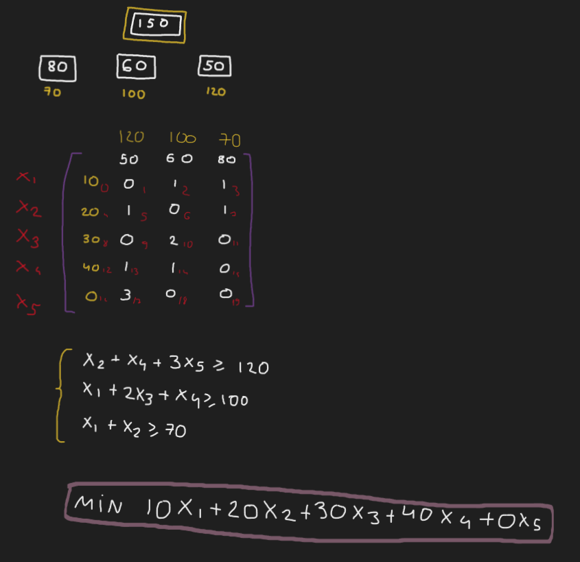

# Problema de corte unidimensional

O problema de corte de estoque unidimensional consiste em cortar objetos disponíveis para a produção de itens de modo a atender uma demanda especificada, em que apenas uma dimensão é relevante para o corte

## Objetivo:

Implementar um modelo genérico de Programação Linear Inteira para resolver o problema de corte unidimensional

## Pré-requisito:

- IDE + Java
- Biblioteca[ OR-Tools](https://drive.google.com/drive/folders/1p6Rv_-L9yC5mb95PGovguOaika1JlADH)

## Exemplo de entrada (arquivo no formato .txt):

150     `Tamanho da barra`

3     `Quantidade de tipos de cortes`

80 60 50     `Tamanho de cada corte`

70 100 120     `Quantidade de cada corte`

## Modelagem usada

